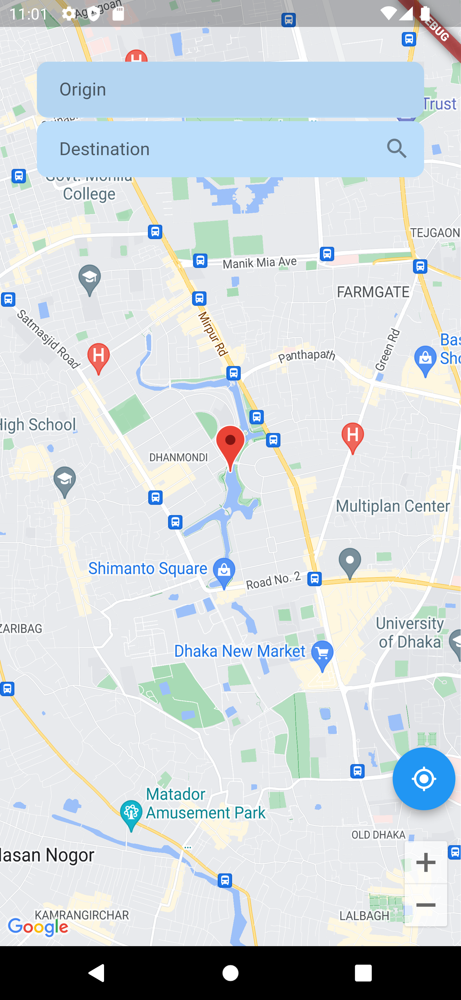
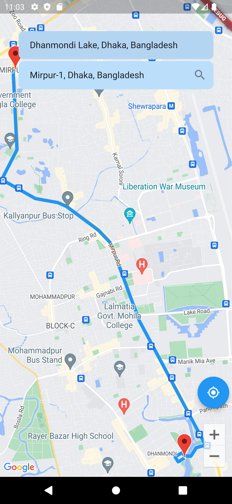
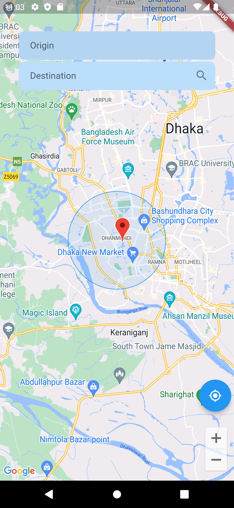

# Google Maps Implementation Using Riverpod

## Overview

This project is a demonstration of how to integrate Google Maps into a Flutter application using the [Riverpod](https://pub.dev/packages/riverpod) state management library. It provides a simple example of how to create a map, add markers, and manage the state of the map using Riverpod.

## Table of Contents

- [Installation](#installation)
- [Usage](#usage)
- [Features](#features)
- [Screenshots](#screenshots)
- [Contributing](#contributing)
- [License](#license)

## Installation

To get started with this project, follow these steps:

1. Clone this repository:
   git clone https://github.com/your-username/google-maps-riverpod.git
2. Change into the project directory:
   cd google-maps-riverpod
3. Install the required dependencies:
   flutter pub get
4. Add your Google Maps API Key to the android/app/src/main/AndroidManifest.xml file and ios/Runner/AppDelegate.swift file. Replace YOUR_API_KEY with your actual API key.
   ``<!-- android/app/src/main/AndroidManifest.xml -->
   <meta-data
   android:name="com.google.android.geo.API_KEY"
   android:value="YOUR_API_KEY"/>
   ``
   ``// ios/Runner/AppDelegate.swift
   GMSServices.provideAPIKey("YOUR_API_KEY")
   ``
## Features
   # Display a Google Map in the Flutter app.
   # Add markers to the map.
   # Implement state management using Riverpod.
   # Showcase best practices for integrating Google Maps.

## Screenshots

   
   
   